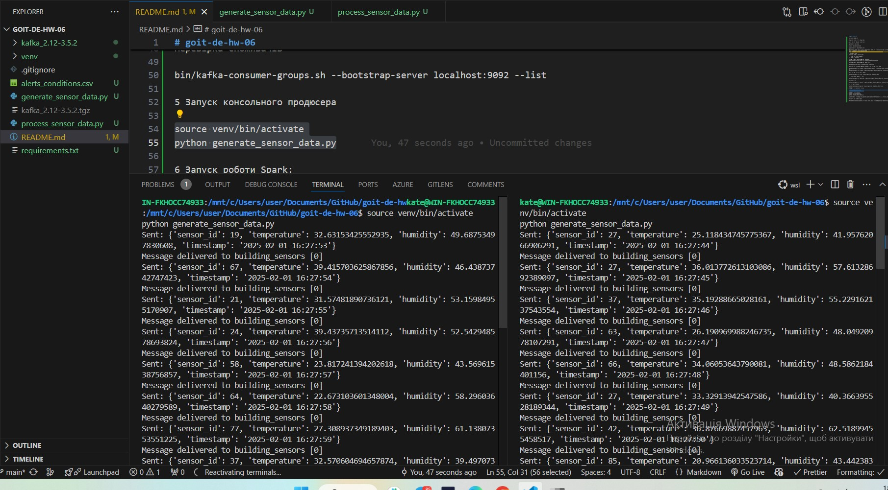
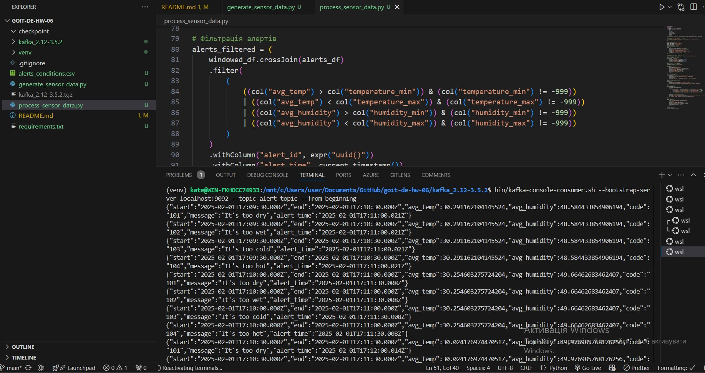

# goit-de-hw-06

Кроки для запуску

Все відкриваємо в терміналі WSL

Створюємо віртуальне середовище

python3 -m venv venv

source venv/bin/activate

pip install -r requirements.txt

Завантажте Kafka: Якщо ви ще не завантажили Kafka, ви можете зробити це за допомогою команди wget або просто завантажити його з офіційного сайту Apache Kafka
wget https://archive.apache.org/dist/kafka/3.5.2/kafka_2.12-3.5.2.tgz

Розпакуйте Kafka
tar -xzf kafka_2.12-3.5.2.tgz

Перейдіть до каталогу Kafka
cd kafka_2.12-3.5.2

1 У першому терміналі запустіть Zookeeper
bin/zookeeper-server-start.sh ./config/zookeeper.properties

2 У другому терміналі запустіть Kafka сервер

bin/kafka-server-start.sh config/server.properties

3 У третьому терміналі запустіть Kafka сервер Створіть тему Kafka

bin/kafka-topics.sh --create --topic building_sensors --bootstrap-server localhost:9092 --partitions 1 --replication-factor 1
bin/kafka-topics.sh --create --topic alert_topic --bootstrap-server localhost:9092 --partitions 1 --replication-factor 1

4 Перевіркаи чи створилися топіки

bin/kafka-topics.sh --list --bootstrap-server localhost:9092

5 Запуск консольного продюсера

source venv/bin/activate
python generate_sensor_data.py

Скріншот роботи консольного продюсера в декількох терміналах

6 Запуск роботи Spark

source venv/bin/activate

spark-submit --packages org.apache.spark:spark-sql-kafka-0-10_2.12:3.5.4 process_sensor_data.py

7 Перевірка конфігурації Spark(провсяк випадок, якщо бувають помилки при запуску консолі споживача Kafka)

spark-submit --conf spark.local.ip=10.255.255.254 --packages org.apache.spark:spark-sql-kafka-0-10_2.12:3.5.4 process_sensor_data.py

Логування

Спробуйте запустити Spark з більш детальним логуванням, щоб отримати більше інформації про помилки

spark-submit --packages org.apache.spark:spark-sql-kafka-0-10_2.12:3.5.4 --conf "spark.eventLog.enabled=true" --conf "spark.eventLog.dir=/tmp/spark-events" process_sensor_data.py

8 Моніторинг топікив Кафки

bin/kafka-console-consumer.sh --bootstrap-server localhost:9092 --topic alert_topic --from-beginning

Скріншот консолі споживача Kafka

